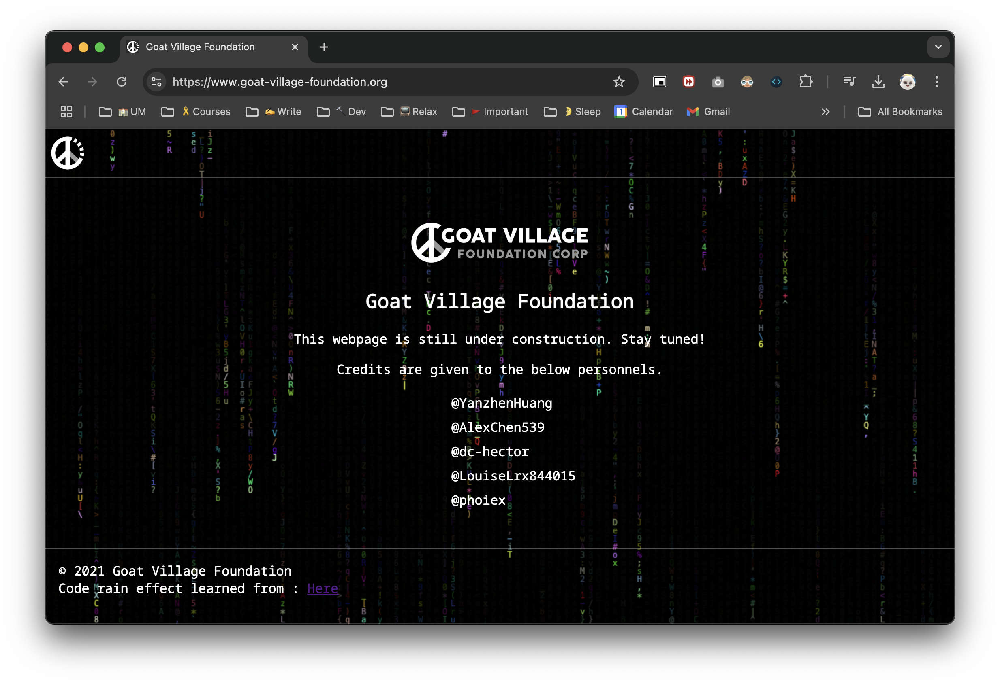

```python
>>> import yz
"Hi!👋 My name is Yanzhen Huang 黄彦祯！"

>>> yz.name
{"Family": "Huang", "Given": "Yanzhen"}

>>> yz.locales
{"Nationality": "🇨🇳", "Living Region": "🇲🇴"}

>>> yz.edu
{"Facility": "University of Macau", "Year": 4}

>>> yz.email
"yanzhenhuangwork@gmail.com"

>>> yz.hobbies
["Designing", "Music", "Coding"]

>>> yz.learning
["Java", "SpringBoot", "Machine Learning", "Pattern Recognition", "Video Editing"]

>>> yz.friends
["@phoiex", "@AlexChen539", "@dc-hector", "@LouiseLrx844015", "@SpinningMai"]

>>> yz.profile.idea
{"From": "@Ziy1-Tan"}
```

## My GitHub Status

**My Ranking on "Most Active GitHub Users" in Macau**

[](https://user-badge.committers.top/macau/YanzhenHuang)

## Socials
Goat Village Foundation. 


We are now constructing our memorial website: [https://www.goat-village-foundation.org](https://www.goat-village-foundation.org)

Please stay tuned for any updates!




